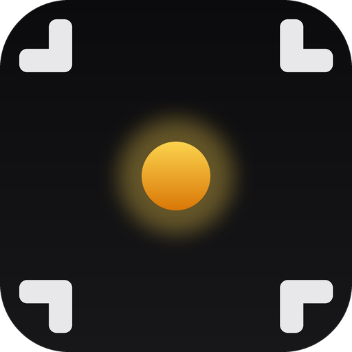
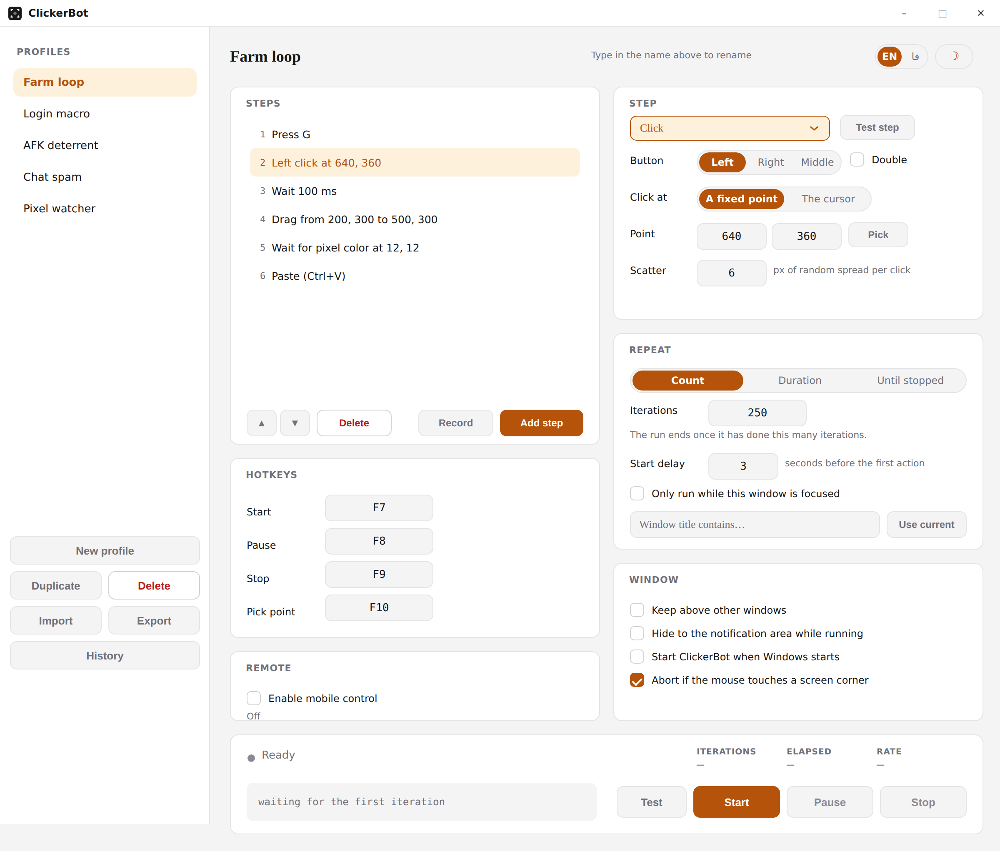
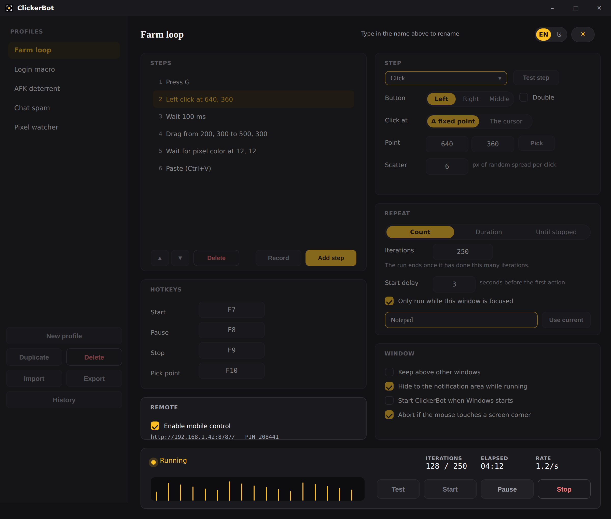
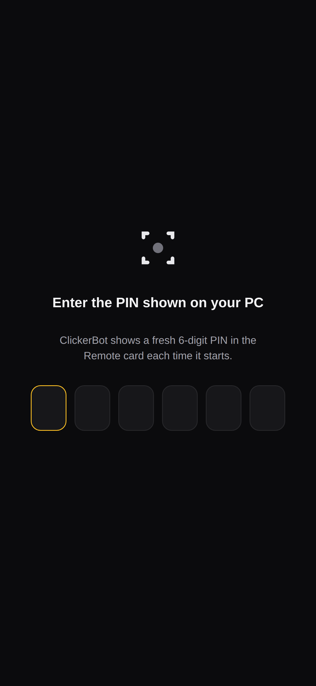
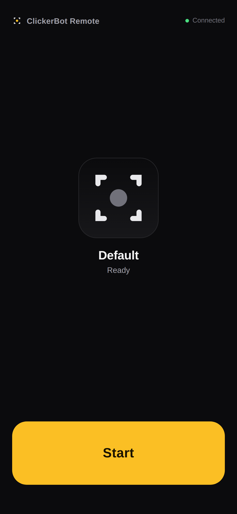
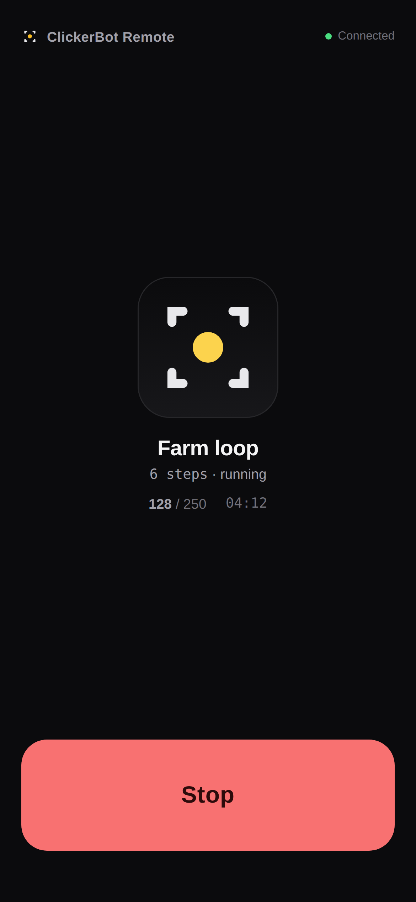
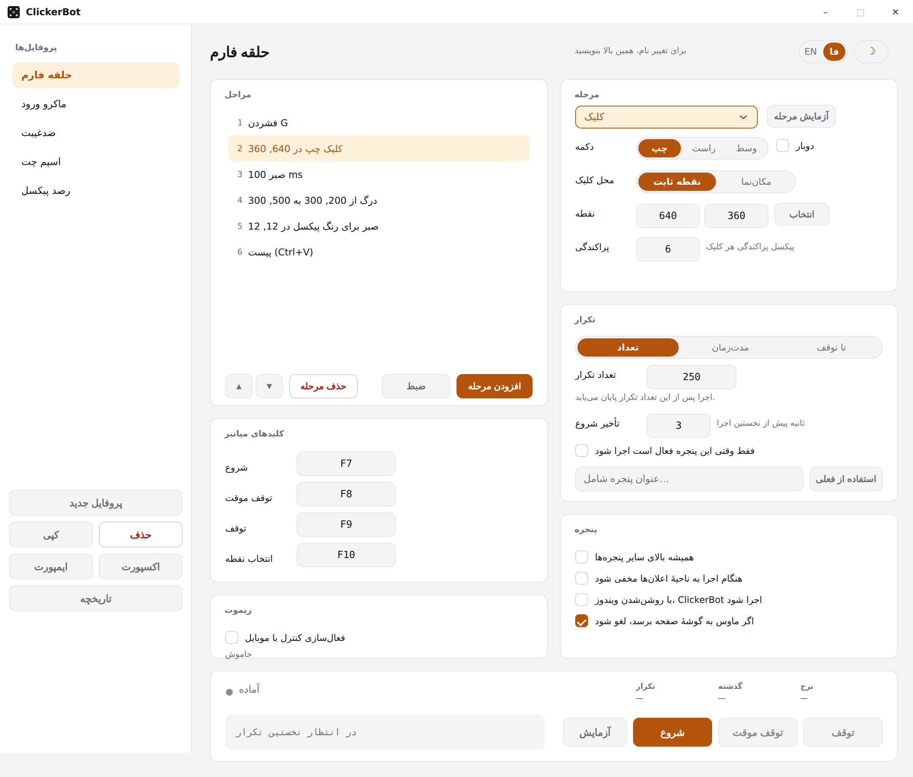
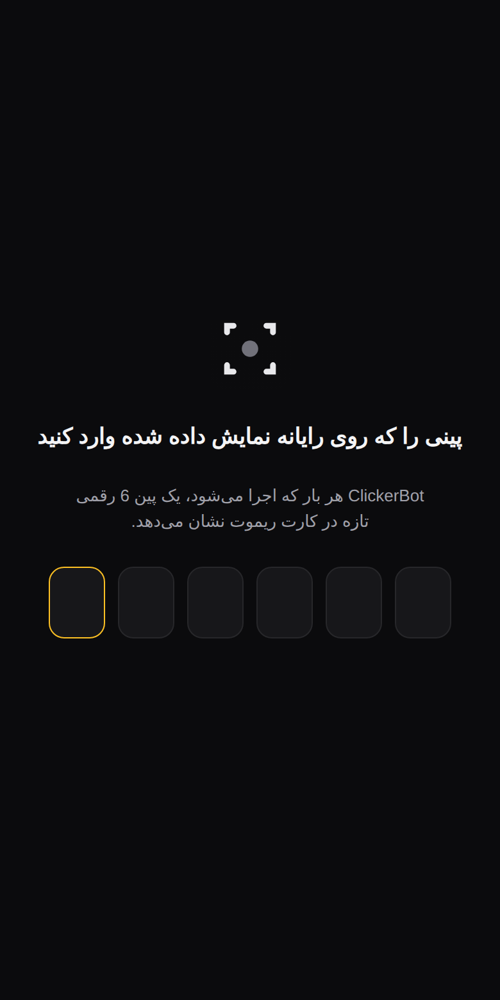
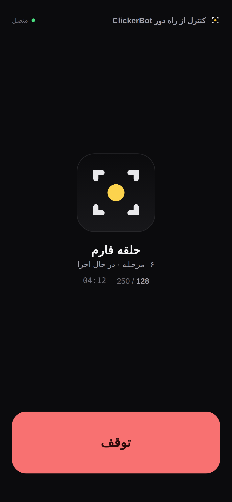

<p align="center">
  
</p>

<h1 align="center">ClickerBot</h1>

<p align="center">A Windows desktop macro tool: build a sequence of steps — key presses, clicks, drags, typed text, waits, even a wait for a pixel to change color — record it live from your own input, and repeat it precisely, on your terms.</p>

<p align="center">
  
  
  
  
</p>

Built with .NET 8 and Windows Forms — every control is custom-drawn, so the interface looks the same whether you're on light or dark, and a live rhythm strip shows a run's actual pacing instead of just a spinning counter. 📱 It now also opens a page on your phone, so you can start and stop a run without walking back to the desk.

<p align="center">
  
  
</p>

---

## Table of contents

- [✨ Features](#-features)
- [🖥️ Requirements](#️-requirements)
- [🚀 Getting started](#-getting-started)
- [🎯 Usage](#-usage)
- [📱 Mobile control](#-mobile-control)
- [🎨 Appearance](#-appearance)
- [🌐 Language](#-language)
- [🔷 Icon and logo](#-icon-and-logo)
- [⌨️ Hotkeys](#️-hotkeys)
- [🗂️ Profiles and data storage](#️-profiles-and-data-storage)
- [🕓 Run history](#-run-history)
- [🪟 Starting with Windows](#-starting-with-windows)
- [📁 Project structure](#-project-structure)
- [⚙️ How it works](#️-how-it-works)
- [📦 Building a standalone release](#-building-a-standalone-release)
- [🛠️ Troubleshooting](#️-troubleshooting)
- [⚠️ Responsible use](#️-responsible-use)
- [📄 License](#-license)

---

## ✨ Features

| Feature | Description |
| --- | --- |
| **Step-sequence macro builder** | A profile is an ordered list of steps — press a key, click, drag, type text, wait, wait for a pixel to match a color, set the clipboard, or paste — that repeats as a whole on every iteration. Reorder, edit, or delete any step; nothing about the sequence's length or shape is fixed. |
| **Macro recorder** | Click **Record** and ClickerBot captures your real mouse and keyboard input live — clicks, drags, and key presses, each with a wait sized to the actual pacing you recorded at — and turns it straight into an editable step sequence. Input aimed at ClickerBot's own window is left out, so reaching back to press **Stop recording** never lands in the macro; your Stop hotkey ends a recording too. |
| **Mouse drag** | A press-move-release motion between two points over a configurable duration (or instant), for targets that only recognize a real drag rather than a teleporting click. |
| **Wait for pixel color** | Pauses a step sequence until a screen pixel matches a target color within a tolerance, or a timeout elapses — for a macro that reacts to something changing on screen instead of just running blind on a timer. |
| **Clipboard steps** | Set the clipboard to fixed text, or paste whatever is currently on it with `Ctrl+V` — either as its own step, wherever it belongs in the sequence. |
| **Window targeting** | Restrict a profile to only run while a chosen window is in front. The run pauses itself the instant that window loses focus and resumes on its own the moment it's back — no risk of a macro firing into whatever you tabbed to instead. |
| **Type text** | Types a fixed line via Unicode input rather than a single mapped key, so any character your keyboard layout can't reach — accents, symbols, other scripts — still works. Handy for repeated chat messages or form filling. |
| **Any key supported** | Letters, digits, function keys, `Tab`, `Enter`, `Space`, punctuation, arrows, and numpad keys. Press `Esc` in a key field to clear it. |
| **Left, right or middle click, single or double** | The mouse button and whether a click step double-clicks are both configurable. |
| **Fixed point or the live cursor** | A click step can target a captured screen coordinate, or wherever the cursor already is so you can steer a run by hand. |
| **Click scatter** | A random pixel radius applied around a click step's target, so every click doesn't land on the exact same coordinate. |
| **Fixed or randomized delays** | A wait step is either a fixed millisecond value or a random value re-drawn from a `min–max` range on every iteration. |
| **Three ways to stop** | An iteration count, a time limit, or run until you stop it by hand. |
| **Start delay** | An optional countdown before the first iteration, so you have time to click into the target window. |
| **Test step / Test run** | The step editor's **Test step** button fires exactly the selected step right now; the run bar's **Test** button fires one full pass of the whole sequence — neither logs a start delay, a repeat count, or a history entry, so you can check a step or the whole macro before committing to a full run. |
| **Pause and resume** | Hold a run in place without losing its iteration count or elapsed time, then continue exactly where it left off. |
| **Failsafe corner-abort** | Slamming the real cursor into any corner of the screen aborts a run immediately — a backstop for when a Stop hotkey couldn't be registered. On by default; turn it off in the *Window* card if a run legitimately needs to click near a corner. |
| **📱 Mobile control** | Enable it in the *Remote* card and ClickerBot serves a phone-friendly page on your LAN with a live status readout and a Start/Stop button — no cables, no companion app. PIN-protected. See [Mobile control](#-mobile-control). |
| **Live cadence strip** | A running strip of ticks, one per completed iteration, laid out on a real time axis — an even comb for a fixed delay, a ragged one for a random range. It's the fastest way to tell a run is behaving the way you configured it. |
| **Position capture** | Click **Pick** — or press its hotkey from anywhere — to store the current cursor position into the selected step's point (and, for a pixel-color step, sample its color at the same time). |
| **Four global hotkeys** | Start, Pause, Stop, and Pick point are all registered system-wide and work while other applications have focus. All four are configurable per profile and must be distinct from each other and from any key-press step. |
| **Profiles** | Create, rename, duplicate, delete, import, and export named configurations. Every step and setting is part of the profile. |
| **Import / export** | Share a profile file between machines, or keep a backup outside `%APPDATA%`, without touching the rest of your saved profiles. |
| **Run history** | The last 50 runs — profile, step count, when, how long, how many iterations, how it ended — kept in a themed dialog off the sidebar, so a run left going unattended has something to show for itself afterwards. |
| **Keep above other windows** | Optionally pins ClickerBot on top so the run panel stays visible over the window being automated. |
| **Notification-area icon** | Present the whole time ClickerBot is running, with Stop and Quit on its right-click menu. Its indicator dot lights amber while a run is in flight, so the taskbar answers "is it going?" without the window on screen. |
| **Hide to the notification area while running** | Drops the window out of the way for the duration of a run and restores it automatically when the run ends. |
| **Start with Windows** | Launches ClickerBot, minimized to the tray, when you sign in — toggled through the same per-user Run key Windows itself uses, no installer needed. |
| **Sound when you're not looking** | Plays a system sound when a run ends while the window is hidden or unfocused — silent if you're already watching it finish. |
| **Auto-save** | Changes are persisted to disk automatically a moment after you make them — nothing to remember to save. |
| **Light & dark themes** | One click on the header switch, with an animated transition. The title bar follows too. See [Appearance](#-appearance). |
| **🌐 English & Persian (فارسی)** | A switch beside the theme toggle translates the entire window, including the phone page — with correct right-to-left layout on the phone page. See [Language](#-language). |
| **High-DPI aware** | Per-monitor V2 DPI awareness, so the UI stays sharp on scaled and mixed-DPI displays — including the parts laid out at runtime, which re-measure themselves when the window moves to a differently-scaled monitor. |

---

## 🖥️ Requirements

- **Windows 10 or Windows 11**
- **[.NET 8 SDK](https://dotnet.microsoft.com/download/dotnet/8.0)** — required to build. Only the [.NET 8 Desktop Runtime](https://dotnet.microsoft.com/download/dotnet/8.0) is needed to run an already-built binary.

The app runs with normal user rights (`asInvoker`). See [Troubleshooting](#️-troubleshooting) if you need to drive an elevated window.

---

## 🚀 Getting started

### The easy way

1. Clone or download this repository.
2. Double-click **`Run.bat`** in the repository root.

That's it. `Run.bat` builds the project in Release mode and then launches it — no terminal required. It builds on *every* run, not just the first: the build is incremental, so there is nothing to compile most of the time and it costs a second or two, and that is what guarantees you are running the code that is actually in the folder rather than an `.exe` left over from before your last `git pull`.

```bash
git clone https://github.com/mrsoulcommunity/ClickerBot.git
```

### The manual way

```bash
dotnet build ClickerBot/ClickerBot.csproj -c Release
```

```bash
dotnet run --project ClickerBot/ClickerBot.csproj -c Release
```

---

## 🎯 Usage

### Building a macro by hand

1. **Add a step** in the *Steps* card, then pick its kind from the selector in the *Step* card: **Press a key**, **Click**, **Drag**, **Type text**, **Wait**, **Wait for pixel color**, **Set clipboard**, or **Paste**. The fields below the selector change to match — only what that kind actually uses.
2. **Fill in the fields for that kind.** A click or a drag's point is set by moving your cursor to the target and pressing the **Pick** hotkey (or clicking **Pick**), or by typing X/Y directly; **Scatter** adds a random pixel radius so clicks don't land on the exact same spot every time. A pixel-color step's **Pick** captures the point *and* samples the color there together, so one click sets up the whole condition.
3. **Reorder, delete, or add more steps** with the toolbar under the step list — the sequence runs top to bottom, in order, once per iteration.
4. **Try a single step** with the **Test step** button in the *Step* card, or the whole sequence once with the run bar's **Test** button, before committing to a full run.

### Recording a macro instead

Click **Record** in the *Steps* card, then just do the thing you want repeated — click, drag, type, press keys — anywhere on screen. ClickerBot turns your real input into steps live, with a wait sized to the actual pacing between each action, so the recording plays back at the speed you did it. Click **Stop recording** when you're done, then edit the result exactly like a hand-built sequence — trim a step, adjust a point, tighten a wait.

### Running it

1. **Tune the timing** in the *Repeat* card: how the run ends — a **Count** of iterations, a **Duration**, or **Until stopped** — and an optional **Start delay** before the first iteration, to give you time to click into the target window.
2. **Restrict it to a window**, optionally: tick **Only run while this window is focused** and either type a substring of its title or click **Use current**, switch to the target window within the countdown, and ClickerBot reads its title for you. The run pauses itself automatically whenever that window isn't in front, and resumes the moment it is again.
3. **Press Start** — or your Start hotkey, or the Start button on your phone. The settings panel locks while a run is in progress; the cadence strip and readouts in the run bar update live.
4. **Pause and resume** with the run bar's Pause button or your Pause hotkey — the iteration count and elapsed time hold in place and continue from there.
5. **Press Stop** — or your Stop hotkey, or your phone, or move the mouse into a screen corner — to cancel at any time.

The switch in the top-right corner flips between light and dark at any time; see [Appearance](#-appearance). Past runs are one click away in **History**, at the bottom of the sidebar.

> **Note**
> A key-press step's key cannot be one of the four hotkeys. Synthesized key presses trigger registered hotkeys just like real ones, so the run would stop itself, restart itself, pause itself, or quietly move the pick target out from under itself. The app blocks these combinations and tells you which one you hit.

---

## 📱 Mobile control

Tick **Enable mobile control** in the *Remote* card and ClickerBot starts a small web server of its own — no separate install, no account, no cloud in between. It hosts a single page built for a phone: a big lamp that mirrors the desktop's own idle/running indicator, live iteration and elapsed-time readouts, and one button that reads **Start** or **Stop** depending on what's currently true.

<p align="center">
  
  
  
</p>

**To connect:** tick the checkbox. A URL and a 6-digit PIN appear directly under it — click that line to copy the URL to your clipboard. Open the URL in your phone's browser (both devices need to be on the same Wi-Fi network), enter the PIN once, and you're in; the page remembers it for next time.

**What it can and can't do:** the page can start a run, stop it, and watch it happen — the same profile and settings you last configured on the desktop. It can't change any setting, switch profiles, or configure a new run; for that you're still at the keyboard. That split is deliberate: the phone is a remote for a run you already set up, not a second cockpit.

**On security, honestly:** the PIN is regenerated every time the server starts, and it gates every request the page makes — starting, stopping, reading the status, and confirming the PIN itself. That's enough to stop a random device on the same Wi-Fi from touching it by accident, but it's LAN-toy security, not a hardened login: there's no rate limiting or account lockout, and the traffic is plain HTTP. Treat it like any other local-network convenience feature — fine for your own home or office Wi-Fi, not something to expose past your router.

**No admin rights.** The server is a plain socket listener rather than a `System.Net.HttpListener`, which is what keeps it out of the way of Windows' URL reservations: the kernel's HTTP stack refuses any address that isn't loopback-only unless an administrator has reserved it first with `netsh http add urlacl`, and naming a concrete LAN address does not get you around that. A socket has no such gate. Windows Firewall may still ask once, the first time a phone reaches in — that prompt is normal, and answering yes is all the setup there is.

**If the port is busy**, ClickerBot walks up from `8787` until it finds a free one. The address under the checkbox always shows the port actually in use, so just read it off there rather than assuming `8787`.

**Which address it shows.** A machine running a VPN, a proxy, or a virtual-machine host has several private addresses up at once, and most of them only work from that machine. ClickerBot listens on all of them but shows the one your phone can actually open first, preferring a real Wi-Fi or Ethernet adapter that has a route off the machine over a tunnel or a host-only bridge.

---

## 🎨 Appearance

The switch in the top-right corner of the header toggles between the light and dark themes. The change is immediate and animated, and it covers the whole window — including the title bar, which is repainted through the Desktop Window Manager rather than left as a light strip above a dark app.

- **First run** starts on whatever appearance Windows itself is set to, read from `AppsUseLightTheme`.
- **Your choice is remembered** in the same file as your profiles, as an application-wide setting. Switching profiles never changes the theme.
- **Nothing else changes.** Themes are purely visual; every automation setting is untouched.

### How theming is built

`Theme` exposes the active `Palette` and raises `Changed` when it is swapped. Controls read colors inside `OnPaint` rather than caching them at construction, so a switch is mostly just a repaint. Stock WinForms controls do cache their colors, so those are wrapped in themed variants that implement `IThemedControl`, and `ThemeManager` walks the control tree calling `ApplyTheme()` on each one — with painting suspended so the change lands in a single frame.

Several controls are drawn from scratch instead of using the framework versions, because Windows paints those itself in system colors and they stay light no matter what is assigned to them: the checkbox glyph, the numeric field's spin buttons, the drop-down list (frame, chevron and popup alike), the menus, and the confirmation dialog. Adding a third appearance would mean adding one `Palette` instance and changing nothing else.

Sizes get the same treatment as colors. Every pixel literal in the layout and paint code is a 96-DPI design measurement passed through `Theme.Scale`, because WinForms' own DPI pass rescales the control tree exactly once and only touches bounds that already existed when it ran — anything positioned or painted afterwards (the step editor re-lays itself on every selection change; the run bar's readouts are drawn, not placed) has to scale itself or it would compose a 100% layout inside a container the framework had already grown.

---

## 🌐 Language

The **EN / فا** switch next to the theme toggle translates the whole window — every card, label, hint, dialog, and status message — between English and Persian. The mobile control page translates with it: open it after switching to Persian and it arrives right-to-left, with its own layout mirrored rather than just its words swapped.

<p align="center">
  
</p>

<p align="center">
  
  
</p>

- **First run** matches whatever display language Windows itself is already set to; everyone else defaults to English.
- **Your choice is remembered** the same way the theme is — an application-wide setting, untouched by switching profiles.
- **Numbers and key names stay put.** Hotkey names (`F7`, `Enter`, `Esc`…), coordinates, milliseconds, and PIN digits are always Western numerals and Latin key names in both languages — the same reasoning as the mono readouts elsewhere in the app: a measurement isn't prose to translate.
- **The desktop window keeps its layout.** Only the words change; cards, fields, and buttons stay exactly where they are in either language. The phone page is different — a browser mirrors plain CSS safely, so it gets a real right-to-left layout, not just right-aligned text.

---

## 🔷 Icon and logo

The mark is a capture reticle — four corner brackets, echoing the app's own Pick-point feature — around a single indicator dot. The reticle never changes; only the dot does, exactly matching the run panel's own rule that color marks the running state and nothing else does. Idle, the dot is a flat grey. Running, it lights amber with a soft glow. The mobile page's own hero lamp is the same mark, so a run looks like the same run whichever screen you're watching it from.

| Where | State | Source |
| --- | --- | --- |
| The compiled `.exe`'s own file icon (Explorer, the taskbar shortcut before launch, Alt-Tab) | Always idle — nothing is running yet | `ClickerBot/Assets/AppIcon.ico`, wired in via `<ApplicationIcon>` |
| The window's title bar and taskbar icon | Idle / running, live | Drawn at runtime by `AppIcon.cs` |
| The notification-area icon, present the whole time the app is | Idle / running, live | Same `AppIcon.cs` |
| This README | The lit mark | `ClickerBot/Assets/logo.png` |

The runtime copy exists because the compiled icon can't relight itself — nothing is running when Explorer shows it. `AppIcon.cs` draws the identical mark with GDI+ instead of loading a raster asset, so it can swap the dot's color the instant a run starts or stops, the same way every other themed control in the app repaints instead of being replaced.

---

## ⌨️ Hotkeys

| Hotkey | Action | Configurable |
| --- | --- | --- |
| `F7` | Start the current profile | Yes — per profile |
| `F8` | Pause or resume the current run | Yes — per profile |
| `F9` | Stop the current run | Yes — per profile |
| `F10` | Capture the cursor position into the selected step's point (and its color, for a pixel-color step) | Yes — per profile |

Hotkeys are registered globally through the Win32 `RegisterHotKey` API, so they fire even when ClickerBot is in the background — including while it's hidden to the notification area. If another application already owns a key, the status bar tells you which binding could not be registered — pick a different one.

All four hotkeys must be distinct from each other, and from any key-press step's key.

**If a hotkey can't be registered, the failsafe still works.** Moving the real mouse cursor into any corner of the screen aborts a run immediately, whether or not the Stop hotkey is available — see [Features](#-features). It's on by default and can be turned off per your preference in the *Window* card.

---

## 🗂️ Profiles and data storage

Profiles hold every configurable value: the step sequence itself, the start delay, the repeat mode, the optional target-window restriction, and all four hotkeys. Switching profiles re-registers that profile's hotkeys immediately. The chosen theme, the language, and the window options (always-on-top, hide-to-tray, the failsafe toggle, mobile control) are stored alongside them but apply to the whole application rather than to a single profile.

A profile saved before macros existed still opens correctly: its old single key-and-click action is converted into the equivalent step sequence the first time it loads, so nothing is lost and there's nothing to redo by hand.

Everything is stored as indented JSON at:

```
%APPDATA%\ClickerBot\profiles.json
```

The file is written automatically shortly after any change and again on exit. Each save is written alongside the real file and swapped in, so an interrupted write cannot leave a truncated file where your profiles were. If the file is ever missing or corrupt, the app falls back to a single fresh **Default** profile rather than failing to start; values outside the ranges the inputs allow are pulled back into range on load, so hand-editing it cannot put the app into a state it will not run.

**Import** reads profiles from another JSON file — one you exported earlier, or another machine's `profiles.json` — and adds them to your existing list under unique names, so importing never overwrites what's already there. **Export** writes your current profiles to a file you choose, without the application-wide settings, so it's portable between machines.

The app was previously called ClickerApp. If nothing is found at the path above, profiles are read once from the old `%APPDATA%\ClickerApp\profiles.json` and saved forward to the new location, so an existing setup carries over on its own. The old folder is left in place and can be deleted whenever you like.

---

## 🕓 Run history

The **History** button at the bottom of the sidebar opens a list of the last 50 runs: which profile, how many steps its sequence had, when it started, how long it ran, how many iterations it completed, and how it ended — Finished, Stopped, a failsafe abort, or an error. A one-shot **Test** doesn't get an entry; it isn't a run.

History is stored separately from your profiles, at `%APPDATA%\ClickerBot\history.json`, with the same crash-safe save as `profiles.json`. **Clear history** in the dialog empties the list — there's a confirmation first, and it can't be undone.

---

## 🪟 Starting with Windows

**Start ClickerBot when Windows starts**, in the *Window* card, adds ClickerBot to your per-user startup programs — the same `HKCU\...\CurrentVersion\Run` registry key Windows' own Settings app manages, so no installer or scheduled task is involved and nothing needs administrator rights.

It launches with a `--minimized` flag that sends the window straight to the notification area instead of popping open on every sign-in — the app is fully running (hotkeys included) from the moment you sign in, it just isn't in your way. Open it any time from the tray icon.

The checkbox reads the registry directly rather than a saved preference, so it always shows whether autostart is *actually* registered, not just whether it was the last time you asked.

---

## 📁 Project structure

```
.
├── ClickerBot/
│   ├── Assets/
│   │   ├── AppIcon.ico            # Compiled .exe's file icon (idle state, multi-resolution)
│   │   ├── logo.png               # README art (lit state)
│   │   ├── logo-idle.png          # README art (idle state)
│   │   └── screenshots/           # README screenshots (app + mobile control, EN + FA)
│   ├── Automation/
│   │   ├── AutomationRunner.cs   # The async step-sequence loop: pausable, time-or-count bounded
│   │   └── RunProgress.cs        # Run phase snapshot + the pause gate (user- and window-focus-driven)
│   ├── Input/
│   │   ├── ForegroundWindow.cs   # Reads/matches the foreground window's title, for window targeting
│   │   ├── HotkeyManager.cs      # Global hotkey registration (RegisterHotKey)
│   │   ├── KeyNames.cs           # Human-readable key labels
│   │   ├── MacroRecorder.cs      # Global low-level hooks that capture real input as a step sequence
│   │   ├── NativeInput.cs        # SendInput/drag/pixel-sample/clipboard wrapper for synthetic input
│   │   └── StartupManager.cs     # Reads/writes the per-user Run registry key
│   ├── Models/
│   │   ├── ActionMode.cs         # Legacy mode / button / repeat-mode / click-target enums
│   │   ├── DelaySetting.cs       # Fixed or random-range delay
│   │   ├── Language.cs           # English / Persian
│   │   ├── Limits.cs             # The valid range of every numeric setting
│   │   ├── MacroStep.cs          # One step in a macro's sequence, and its StepKind
│   │   ├── Profile.cs            # One named configuration: its step sequence and settings
│   │   ├── ProfileStore.cs       # JSON load/save, plus import/export
│   │   └── RunHistory.cs         # A finished run's record, and its JSON load/save
│   ├── Remote/
│   │   ├── RemoteControlServer.cs   # Local HTTP server: routing, PIN auth, the mobile page itself
│   │   └── RemoteStatusPayload.cs   # The status snapshot served to the phone
│   ├── Ui/
│   │   ├── Controls/
│   │   │   ├── CadenceMeter.cs     # Live per-iteration rhythm strip
│   │   │   ├── Card.cs             # Titled section container
│   │   │   ├── ConfirmDialog.cs    # Themed replacement for MessageBox
│   │   │   ├── DelayEditor.cs      # Fixed/random delay control
│   │   │   ├── Dropdown.cs         # Owner-drawn drop-down list (the step-kind selector)
│   │   │   ├── FlatButton.cs       # Owner-drawn button (primary/secondary/danger)
│   │   │   ├── KeyCaptureBox.cs    # Field that records the next key pressed
│   │   │   ├── NumberBox.cs        # Owner-drawn numeric field with steppers
│   │   │   ├── ProfileListBox.cs   # Owner-drawn profile list
│   │   │   ├── RunHistoryDialog.cs # Themed dialog listing past runs
│   │   │   ├── RunPanel.cs         # Run bar: status, readouts, cadence strip, transport
│   │   │   ├── Segmented.cs        # Owner-drawn segmented choice control
│   │   │   ├── StepListBox.cs      # Owner-drawn list of a macro's steps
│   │   │   ├── SurfacePanel.cs     # Panel that tracks the surface color
│   │   │   ├── TextField.cs        # Owner-drawn free-text field (Type-text / Set-clipboard steps)
│   │   │   ├── ThemeToggle.cs      # Animated light/dark switch
│   │   │   ├── ThemedCheckBox.cs   # Owner-drawn checkbox
│   │   │   ├── ThemedLabel.cs      # Label that stores a role, not a color
│   │   │   ├── ThemedMenuRenderer.cs # Palette-driven menus (dropdown popup + tray menu)
│   │   │   └── ThemedTextBox.cs    # Palette-aware text box
│   │   ├── Localization/
│   │   │   └── Loc.cs              # Every interface string, in both languages
│   │   ├── Theming/
│   │   │   ├── Palette.cs          # One complete set of colors
│   │   │   ├── Theme.cs            # Active palette, fonts, drawing helpers
│   │   │   ├── ThemeManager.cs     # Pushes the theme through the control tree
│   │   │   ├── ThemeMode.cs        # Light / Dark
│   │   │   └── WindowChrome.cs     # Dark title bar + system preference
│   │   ├── AppIcon.cs             # Drawn window/tray icon, amber when a run is active
│   │   ├── MainForm.cs            # Wiring: profiles, settings, hotkeys, run control, tray, remote server
│   │   ├── MainForm.Layout.cs     # Where every control is placed
│   │   └── UiFactory.cs           # Small control factory helpers
│   ├── app.manifest              # DPI awareness, execution level, OS support
│   ├── ClickerBot.csproj
│   └── Program.cs                # Entry point; handles the --minimized launch flag
├── .gitattributes                # Line-ending rules (CRLF for .bat)
├── .gitignore
├── LICENSE                       # MIT
├── README.md
└── Run.bat                       # One-click build-and-launch script
```

---

## ⚙️ How it works

A profile is an ordered `List<MacroStep>`. `AutomationRunner.RunAsync` drives the loop while the UI thread stays responsive; each iteration is one call to `PerformIterationAsync`, which runs every step in order through `PerformStepAsync`, a switch on `StepKind`:

- **KeyPress** — synthesize a key-down/key-up pair via `SendInput`.
- **Click** — move the cursor (unless the target is the live cursor position), then synthesize the configured button — twice, for a double-click. A **scatter** radius, if set, offsets the point by a random amount inside that radius on every click, sampled evenly across the disc rather than bunched toward the center.
- **Drag** — press the button at the start point, then travel to the end point over the configured duration (awaited between frames rather than blocked, so the UI thread stays responsive for up to the full duration), then release — wrapped in a `finally` so cancelling mid-drag can never leave the button physically stuck down.
- **TypeText** — synthesize one `SendInput` Unicode event pair per character, bypassing virtual-key mapping entirely so any character your keyboard layout can't reach still types correctly.
- **Wait** — `DelaySetting.Next()` for a fresh value (fixed or random-range) and `Task.Delay` it.
- **WaitForPixelColor** — poll the target pixel every 100ms against the target color and tolerance until it matches or the step's own timeout elapses; a timeout is not a failure, the macro just moves on to the next step.
- **ClipboardSet / ClipboardPaste** — write fixed text to the clipboard, or synthesize `Ctrl+V`.

The **Test step** button in the step editor runs a single step through the same `PerformStepAsync`; the run bar's **Test** button runs one full pass of `PerformIterationAsync`. There is exactly one place that knows how to perform a step and one that knows how to perform an iteration, and every path — a real run, a one-shot test, a single step's test — goes through them. Only the bookkeeping differs: a test records no history entry.

Around the sequence, the loop:

1. Waits out the start delay, if any, reporting a countdown each second (skipped entirely for a test).
2. Checks the stop condition — iteration count or elapsed duration — before each iteration.
3. Reports progress to the UI and marks the iteration on the cadence strip.
4. Runs the step sequence, then repeats — except on a count-limited run's very last iteration, where any `Wait` steps trailing the end of the sequence are skipped, since there is nothing left to pace against.

Cancellation is cooperative through a `CancellationTokenSource`, checked before each step and honored by every `Task.Delay`, so **Stop** — including a failsafe-triggered one — takes effect within one step or delay interval at most.

**Pause** goes through a `PauseGate` rather than cancellation, and it now tracks two independent reasons a run can be held: your own Pause button, and — for a profile restricted to a target window — that window not currently being in front. Either one holds the gate closed; resuming requires every reason currently holding it to clear, so a run you paused by hand never auto-resumes just because the target window happened to regain focus. The elapsed-time clock stops while the gate is closed either way, so a duration-limited run doesn't burn its budget sitting held.

**Window targeting** is polled on the same 100ms UI timer as the cadence strip and the failsafe: for a profile with `RequireTargetWindow` set, `ForegroundWindow.Matches` checks the current foreground window's title against a case-insensitive substring, and the result is fed into the `PauseGate`. The *Repeat* card's **Use current** button can't simply read the foreground window at the moment it's clicked — clicking it makes ClickerBot itself the foreground window first — so it runs a short countdown instead, giving you time to switch to the intended window before it captures the title.

**The macro recorder** (`MacroRecorder`) installs global `WH_KEYBOARD_LL` and `WH_MOUSE_LL` hooks and only ever observes — every hook callback calls `CallNextHookEx`, so recording never blocks the input it's watching. A key press becomes a `KeyPress` step; a mouse down/up pair becomes a `Click` step, or a `Drag` step if the cursor moved more than a few pixels between them, tracked per button so holding two at once doesn't lose either. A `Wait` step is inserted ahead of each capture sized to the real elapsed time since the previous one, so the recording reproduces the pacing it was recorded at, not just the actions.

Two things are deliberately not recorded. Input over ClickerBot's own window is dropped — a low-level hook sees the mouse-up on **Stop recording** before that message is ever dispatched to the button, so without the filter every recording would end with a click on the app's own toolbar. So are the profile's four hotkeys, for the same reason applied to the keyboard: they drive the recording rather than belonging inside it, and Stop ends a recording just as it ends a run.

**The failsafe** is checked on that same 100ms timer: if the real cursor is within a pixel of any corner of `SystemInformation.VirtualScreen`, the run is cancelled with a reason that overrides the ordinary "Stopped" message — unless that corner happens to be one of the sequence's own Click or Drag points, since a run is allowed to legitimately park the cursor there.

**A profile saved before macros existed** carries its old single-action fields (`Mode`, `Key`, `ClickX`, and so on) marked as legacy, read exactly once. `Profile.Normalize` calls `BuildLegacyMigrationSteps` whenever a profile's `Steps` list is empty, reconstructing the equivalent sequence — the same path a brand-new profile's untouched property defaults go through, which is what gives it a sensible first step to look at instead of an empty list.

**Mobile control** speaks HTTP/1.1 over a plain `TcpListener` bound to `IPAddress.Any`. It deliberately does not use `System.Net.HttpListener`: that class is a front end for the kernel's `http.sys`, which rejects any prefix that is not loopback-only unless an administrator has reserved it with `netsh http add urlacl` — and a concrete LAN address is no better off than the `http://+:PORT/` wildcard in that respect. Both fail with "Access is denied" for a standard user, which is why the server is a socket instead. Four fixed routes with no request bodies worth reading is a small enough surface to parse by hand. `MainForm` hands it three callbacks (`GetStatus`, `RequestStart`, `RequestStop`); since connections are handled on background threads, every one of those callbacks marshals back onto the UI thread — `Invoke` for the status read, which needs a return value, `BeginInvoke` for start/stop, which don't. The PIN is regenerated with `RandomNumberGenerator` each time the server starts and compared in constant time, so a failed guess can't be timed to narrow down the right one; because it changes on every start, the page treats a `401` on its status poll as "this app restarted" and re-shows its lock screen rather than sitting on a status that stopped updating.

**Which LAN address to show** is a guess, not a lookup: a machine with a VPN client, a tunnelling proxy or a VirtualBox host-only bridge has several private IPv4 addresses up simultaneously, and `NetworkInterface.GetAllNetworkInterfaces` returns them in no useful order. `LocalIPv4Addresses` ranks rather than filters — a real Wi-Fi or Ethernet `NetworkInterfaceType` that also has a default gateway wins, an adapter whose name gives it away as virtual loses, and the rest fall in between. The socket is bound to every interface regardless, so a wrong guess only costs the label a better suggestion.

**Language** mirrors the theme's own architecture: `Loc` exposes every string as a property and raises `Changed` when `Apply` switches languages, the same shape as `Theme`. `ThemeManager.Attach` already walks the control tree on a theme switch with painting suspended so the change lands in one frame; it now does the same walk on a language switch, calling an `ApplyLanguage()` on every control that implements `ILocalizedControl` and, for the window itself, a callback `MainForm` supplies. The mobile page takes a different path: since it is plain HTML re-served on every request rather than a long-lived control tree, `RemoteControlServer` just fills a handful of `__TOKEN__` placeholders and a labels object from `Loc.Current` each time the page is requested, and sets `dir="rtl"` — safe to mirror for real there, since a browser handles that natively; the desktop side deliberately does not attempt it, since mirroring fifteen owner-drawn GDI+ controls by hand is a much larger risk for the same benefit.

Extended keys (arrows, `Insert`, `Delete`, `Home`, `End`, `Page Up`/`Page Down`, numpad `/`, right `Ctrl`/`Alt`, and others) are flagged with `KEYEVENTF_EXTENDEDKEY` so target applications receive them correctly.

---

## 📦 Building a standalone release

To produce a single self-contained executable that runs without the .NET runtime installed:

```bash
dotnet publish ClickerBot/ClickerBot.csproj -c Release -r win-x64 --self-contained true -p:PublishSingleFile=true
```

The result lands in `ClickerBot/bin/Release/net8.0-windows/win-x64/publish/`.

For a much smaller build that requires the .NET 8 Desktop Runtime on the target machine:

```bash
dotnet publish ClickerBot/ClickerBot.csproj -c Release -r win-x64 --self-contained false -p:PublishSingleFile=true
```

---

## 🛠️ Troubleshooting

**A hotkey does nothing, and the status bar mentions another app.**
Windows grants a global hotkey to the first application that asks for it. Another running program owns that key — choose a different one in the *Hotkeys* card.

**"Could not move the cursor … " or "SendInput failed … Input may be blocked by an elevated window."**
Windows blocks synthetic input from a normal-rights process to a process running as administrator. Either run the target application without elevation, or run ClickerBot as administrator. To make elevation permanent, change `asInvoker` to `requireAdministrator` in [`ClickerBot/app.manifest`](ClickerBot/app.manifest) and rebuild.

**The click lands in the wrong place.**
Coordinates are absolute screen pixels across the whole virtual desktop. Re-capture the position with the Pick hotkey if you changed your display scaling, resolution, or monitor arrangement — or set **Click at** to **The cursor** if you'd rather aim it by hand each time.

**`Run.bat` reports that the .NET SDK was not found.**
Install the [.NET 8 SDK](https://dotnet.microsoft.com/download/dotnet/8.0), then run the file again.

**My settings disappeared.**
Check that `%APPDATA%\ClickerBot\profiles.json` exists and is readable. A corrupt file is ignored on startup and replaced with a fresh default profile. Run history lives in a separate `history.json` next to it and follows the same rule.

**A run keeps stopping itself the moment it starts, saying the mouse touched a corner.**
The profile's own click point is a screen corner (or close to one), and something outside the run nudged the cursor before the automation could park it there itself. Either move the click target away from the corner, or turn off **Abort if the mouse touches a screen corner** in the *Window* card for that profile.

**Recording captured something I didn't mean to do.**
Input over ClickerBot's own window is never recorded, and neither are the profile's four hotkeys — so clicking **Stop recording**, or pressing your Stop hotkey, ends the capture without leaving a step behind. Anything else you do while recording is fair game, including clicks on other applications' title bars and taskbar buttons. Trim what you don't want afterwards: a recording is an ordinary step sequence, and every step in it can be edited or deleted.

**Starting with Windows is checked, but ClickerBot didn't launch at sign-in.**
Some third-party startup managers and enterprise policies clear entries from the per-user Run key. Re-check the box, or add ClickerBot through your startup manager pointing at the ClickerBot executable with a `--minimized` argument.

**I can't find ClickerBot's icon in the notification area.**
It is there for as long as the app is running, but Windows 11 hides every newly registered tray icon behind the `⌃` chevron by default. Click the chevron to see it, and drag it down onto the taskbar to keep it visible — or set it permanently under *Settings → Personalisation → Taskbar → Other system tray icons*. That default is Windows', not something an application chooses.

**My phone can't reach the mobile control page.**
Both devices need to be on the same Wi-Fi network — the server listens on your LAN, not the public internet. Use the address shown under the checkbox in the *Remote* card exactly as written, port included: if you have a VPN, a proxy client, or virtual-machine software installed, your PC has several private addresses at once and only the LAN one works from a phone. ClickerBot already picks that one for you, so read it off the card rather than from `ipconfig`. If it still won't load, check Windows Firewall isn't blocking ClickerBot on a network you've marked Public (accept the firewall prompt, or allow it manually for Private/Domain networks).

**The mobile page loads on the PC but not on the phone.** Some VPN and proxy clients route the phone's traffic away from the local network entirely. Turn the VPN off on the phone — not on the PC — and try the address again.

**The mobile page asks for the PIN again after it worked before.**
The PIN is regenerated every time the server starts — including every time you toggle *Enable mobile control* off and back on, or restart ClickerBot. Read the new one off the *Remote* card.

---

## ⚠️ Responsible use

This tool synthesizes real keyboard and mouse input at the operating-system level. Use it for legitimate automation — repetitive data entry, testing your own software, accessibility assistance, and similar tasks. Many online games and web services prohibit automated input in their terms of service, and using this tool against them may get your account suspended. You are responsible for how you use it.

---

## 📄 License

Released under the [MIT License](LICENSE). You are free to use, modify, and distribute this software, including commercially, provided the copyright notice and license text are retained. The software is provided as-is, without warranty of any kind.
